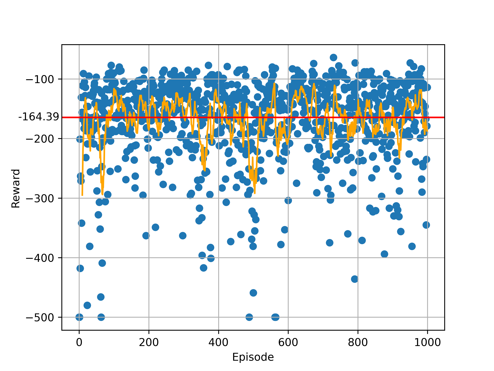
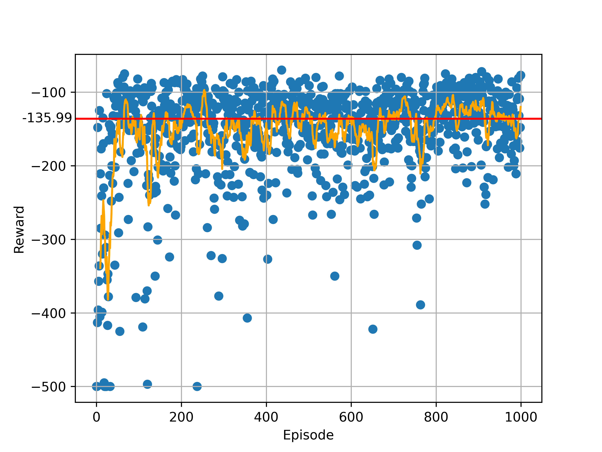

# DQN / DDQN

This folder contains an implementation of the reinforcement learning algorithms of DQN and DDQN.

To reproduce the results, first install the dependencies:
```
$ python venv env
$ source env/bin/activate
$ pip install --upgrade pip
$ pip install -r requirements
```

then execute the experiment with an agent (`DQN` or `DDQN`):
```
python main.py --agent AGENT
```

Per default, the results will be written to the [results](results/) folder.

To see all configurable parameters, execute:
```
python main.py -h
```

## Results

Results are written into a csv-file. The content of this file can be plotted with the `plot_csv.py` script.
The script has following interface:
```
usage: plot_csv.py [-h] --csv CSV --png PNG

plot_csv

optional arguments:
  -h, --help  show this help message and exit
  --csv CSV   input csv file
  --png PNG   output png file
```

When using the default paramters, you will get following graphs for the DQN and DDQN agent:





## References

- https://keon.github.io/deep-q-learning/
- https://github.com/keon/deep-q-learning/
- https://arxiv.org/pdf/1312.5602.pdf
- https://arxiv.org/pdf/1509.06461v3.pdf
- https://towardsdatascience.com/deep-q-learning-tutorial-mindqn-2a4c855abffc   
